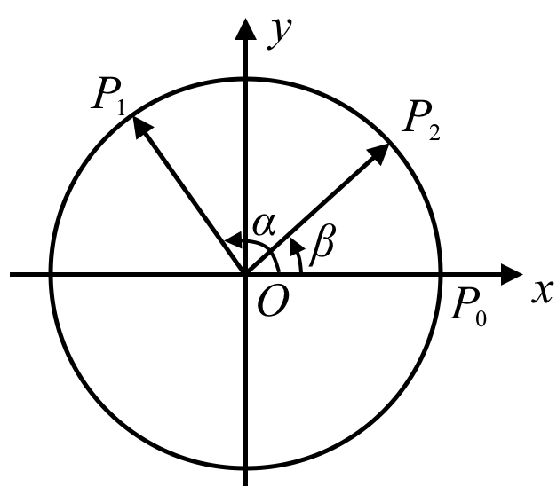
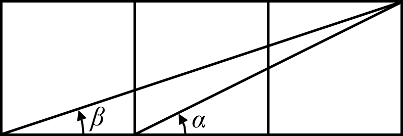
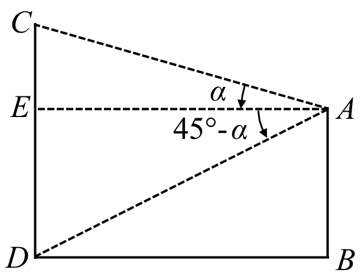

   

# 印象

&emsp;&emsp;三角恒等变换是解决三角函数问题的核心工具，其本质是通过代数变形将复杂的三角表达式转化为更简洁或更易处理的形式.  
&emsp;&emsp;本部分内容长，公式多，学习需要6课时左右.课后也需要一定时间记忆与练习，要达到随手使用的水平有一定难度.学习本部分最大的目的即为后面用三角知识解决各种具体问题做好准备.  

# 三角恒等变换

&emsp;&emsp;我们在学习对数时知道，对于正实数$a,b$，一般$\lg (a+b)\ne \lg a+\lg b$，但可以用$a,b$的对数，来表示$ab$或$\frac{a}{b}$的对数，并可由此化简很多涉及对数的表达式. 类似地，对于三角函数也有相似的情况. 本章中，我们要学习两个角的和与差的三角公式，即学习如何用$\alpha ,\beta$的正弦、余弦及正切来表示$\alpha \pm \beta$的正弦、余弦及正切，并在此基础上学习如何运用这组公式及其推论来化简有关的三角表达式.   

## 两角和差公式

&emsp;&emsp;由于$\cos {{15}\degree}=\cos ({{45}\degree}-{{30}\degree})$且${{45}\degree}$和${{30}\degree}$的三角函数值均为已知，那么自然地要问：能否用${{45}\degree}$和${{30}\degree}$的三角函数值表达$\cos ({{45}\degree}-{{30}\degree})$呢？  

### 两角和与差的余弦公式

&emsp;&emsp;把$\cos (\alpha -\beta)$看成两个向量夹角的余弦，考虑用向量的数量积来研究.    
&emsp;&emsp;如图1.1，在平面直角坐标系坐标系$xOy$中，以$x$正半轴为始边分别作角$\alpha ,\beta$，其终边分别与单位圆交于${{P}_{1}}(\cos \alpha ,\sin \alpha )$，${{P}_{2}}(\cos \beta,\sin \beta)$，则$\angle {{P}_{1}}O{{P}_{2}}=\alpha -\beta$. 由于余弦函数是周期为$2\pi$的偶函数，所以我们只需考虑$0\le \alpha -\beta<\pi$的情况.  

图1.1

&emsp;&emsp;根据数量积的定义有
$$
    \overrightarrow{O{{P}_{1}}}\cdot \overrightarrow{O{{P}_{2}}}=\left| \overrightarrow{O{{P}_{1}}} \right|\left| \overrightarrow{O{{P}_{2}}} \right|\cos (\alpha -\beta)=\cos (\alpha -\beta)
$$
&emsp;&emsp;另一方面，由数量积的坐标表示有
$$
    \cos (\alpha -\beta)=\cos \alpha \cos \beta+\sin \alpha \sin \beta\tag{${C}_{\alpha -\beta}$}
$$ 
&emsp;&emsp;这就是**两角差的余弦公式**.  
&emsp;&emsp;事实上，也可用两点间的距离公式证明两角差的余弦公式，请读者自行证明.   
&emsp;&emsp;在两角差的余弦公式中，用$-\beta$代替$\beta$，再使用诱导公式，就可以得到
$$
    \cos (\alpha +\beta)=\cos \alpha \cos \beta-\sin \alpha \sin \beta\tag{${C}_{\alpha +\beta}$}
$$
&emsp;&emsp;这就是两角和的余弦公式.   
&emsp;&emsp;这种推导公式的方法叫作代入法. 代入法在后续的公式推导和应用中也能起到很大的作用.   
&emsp;&emsp;例 1. 利用两角和与差的余弦公式，求$\cos {{75}\degree},\cos {{15}\degree},\sin {{15}\degree},\tan {{15}\degree}$.   
&emsp;&emsp;解&emsp;由两角和与差的余弦公式，得
$$
    \begin{align*}
    \cos {{75}\degree} &= \cos ({{45}\degree}+{{30}\degree})=\cos {{45}\degree}\cos {{30}\degree}-\sin {{45}\degree}\sin {{30}\degree} \\ 
    &= \left( \frac{\sqrt{2}}{2} \right)\left( \frac{\sqrt{3}}{2} \right)-\left( \frac{\sqrt{2}}{2} \right)\left( \frac{1}{2} \right)=\frac{\sqrt{6}-\sqrt{2}}{4}
    \end{align*}
$$
$$
    \begin{align*}
    \cos {{15}\degree} &= \cos ({{45}\degree}-{{30}\degree})=\cos {{45}\degree}\cos {{30}\degree}+\sin {{45}\degree}\sin {{30}\degree} \\ 
    &= \left( \frac{\sqrt{2}}{2} \right)\left( \frac{\sqrt{3}}{2} \right)+\left( \frac{\sqrt{2}}{2} \right)\left( \frac{1}{2} \right)=\frac{\sqrt{6}+\sqrt{2}}{4}  
    \end{align*}
$$
&emsp;&emsp;由诱导公式得
$$
    \sin {{15}\degree}=\cos \left( {{90}\degree}-{{75}\degree} \right)=\cos {{75}\degree}=\frac{\sqrt{6}-\sqrt{2}}{4}
$$
$$
    \tan {{15}\degree}=\frac{\sin {{15}\degree}}{\cos {{15}\degree}}=\frac{\sqrt{6}-\sqrt{2}}{\sqrt{6}+\sqrt{2}}=2-\sqrt{3}
$$

&emsp;&emsp;思考：你能用构造直角三角形验证结果吗？  

&emsp;&emsp;例 2. 已知$\sin \alpha =\frac{2}{3},a\in \left( \frac{\pi}{2},\pi \right)$,$\cos \beta=-\frac{3}{5},\beta\in \left( \pi,\frac{3\pi}{2} \right)$，求$\cos (\alpha +\beta)$.   
&emsp;&emsp;解&emsp;由$a\in \left( \frac{\pi}{2},\pi \right)$得
$$
    \cos \alpha =-\sqrt{1-{{\sin }^{2}}\alpha }=-\sqrt{1-{{\left( \frac{2}{3} \right)}^{2}}}=-\frac{\sqrt{5}}{3}
$$
&emsp;&emsp;由$\beta\in \left( \pi,\frac{3\pi}{2} \right)$得
$$
    \sin \beta=-\sqrt{1-{{\cos }^{2}}\beta}=-\sqrt{1-{{\left( \frac{3}{5} \right)}^{2}}}=-\frac{4}{5}
$$
&emsp;&emsp;由${{C}_{\alpha +\beta}}$得
$$
    \begin{align*}
    & \cos (\alpha +\beta)=\cos \alpha \cos \beta-\sin \alpha \sin \beta \\ 
    &= \left( -\frac{\sqrt{5}}{3} \right)\left( -\frac{3}{5} \right)-\left( \frac{2}{3} \right)\left( -\frac{4}{5} \right) \\ 
    &= \frac{8+3\sqrt{5}}{15}  
    \end{align*}
$$

&emsp;&emsp;思考：在上例中，你能求出$\sin (\alpha +\beta)$的值吗？

### 两角和与差的正弦公式

&emsp;&emsp;回顾1.1节中的例1求$\sin {{15}\degree}$的过程，我们先将其转化为$\cos {{75}\degree}$，再利用两角和的余弦公式来计算. 而$\sin {{15}\degree}=\sin ({{45}\degree}-{{30}\degree})$，那么有没有两角和与差的正弦公式呢？  
&emsp;&emsp;不难发现，使用诱导公式即可由两角差的余弦公式推得两角和的正弦公式，即
$$
    \begin{align*}
    \sin (\alpha +\beta) &= \cos \left( \frac{\pi}{2}-(\alpha +\beta) \right) \\ 
    &= \cos \left( \left( \frac{\pi}{2}-\alpha  \right)-\beta \right) \\ 
    &= \cos \left( \frac{\pi}{2}-\alpha  \right)\cos \beta+\sin \left( \frac{\pi}{2}-\alpha  \right)\sin \beta \\ 
    &= \sin \alpha \cos \beta+\cos \alpha \sin \beta  
\end{align*}
$$
&emsp;&emsp;即
$$
    \sin (\alpha +\beta)=\sin \alpha \cos \beta+\cos \alpha \sin \beta\tag{${S}_{\alpha +\beta}$}
$$
&emsp;&emsp;在两角差的正弦公式中，用$-\beta$代替$\beta$，再使用诱导公式，就可以得到
$$
    \sin (\alpha -\beta)=\sin \alpha \cos \beta-\cos \alpha \sin \beta\tag{${S}_{\alpha -\beta}$}
$$
&emsp;&emsp;这就是**两角差的正弦公式**.  

&emsp;&emsp;思考：为什么先得到两角和与差的余弦公式，再得到两角和与差的正弦公式呢？能否先得到两角和与差的正弦公式呢？  

&emsp;&emsp;例 1. $\sin \alpha =\frac{2}{3},a\in \left( \frac{\pi}{2},\pi \right)$,$\cos \beta=-\frac{3}{5},\beta\in \left( \pi,\frac{3\pi}{2} \right)$，求$\sin (\alpha +\beta)$.   
&emsp;&emsp;解&emsp;由$a\in \left( \frac{\pi}{2},\pi \right)$得
$$
    \cos \alpha =-\sqrt{1-{{\sin }^{2}}\alpha }=-\sqrt{1-{{\left( \frac{2}{3} \right)}^{2}}}=-\frac{\sqrt{5}}{3}
$$
&emsp;&emsp;由$\beta\in \left( \pi,\frac{3\pi}{2} \right)$得
$$
    \sin \beta=-\sqrt{1-{{\cos }^{2}}\beta}=-\sqrt{1-{{\left( \frac{3}{5} \right)}^{2}}}=-\frac{4}{5}
$$
&emsp;&emsp;由${{S}_{\alpha +\beta}}$得
$$
    \begin{align*}
    \sin (\alpha +\beta) &= \sin \alpha \cos \beta+\cos \alpha \sin \beta \\ 
    &= \left( \frac{2}{3} \right)\left( -\frac{3}{5} \right)+\left( -\frac{\sqrt{5}}{3} \right)\left( -\frac{4}{5} \right) \\ 
    &= \frac{-6+4\sqrt{5}}{15}  
    \end{align*}
$$

&emsp;&emsp;例 2. 已知$\cos \left( \alpha +\beta \right)=\frac{5}{13},\cos \beta=\frac{4}{5},$$\alpha ,\beta$均为锐角，求$\sin \alpha$.   
&emsp;&emsp;解&emsp;由$\alpha ,\beta$均为锐角，可知$0<\alpha +\beta<\pi$，由$\cos \left( \alpha +\beta \right)=\frac{5}{13}$，得
$$
    \sin (\alpha +\beta)=\sqrt{1-{{\cos }^{2}}(\alpha +\beta)}=\sqrt{1-{{\left( \frac{5}{13} \right)}^{2}}}=\frac{12}{13}
$$
&emsp;&emsp;由$\cos \beta=\frac{4}{5}$，得
$$
    \sin \beta=\sqrt{1-{{\cos }^{2}}\beta}=\sqrt{1-{{\left( \frac{4}{5} \right)}^{2}}}=\frac{3}{5}
$$
&emsp;&emsp;由${{S}_{\alpha -\beta}}$，得
$$
    \begin{align*}
    \sin \alpha &= \sin \left( (\alpha +\beta)-\beta \right) \\ 
    &= \sin (\alpha +\beta)\cos \beta-\cos (\alpha +\beta)\sin \beta \\ 
    &= \left( \frac{12}{13} \right)\left( \frac{4}{5} \right)-\left( \frac{5}{13} \right)\left( \frac{3}{5} \right)=\frac{33}{65}  
    \end{align*}
$$

&emsp;&emsp;例 3. 求证$\frac{\sin(2A+B)}{\sin A}-2\cos(A+B)=\frac{\sin B}{\sin A}$.
&emsp;&emsp;证明  
$$
    \begin{align*}
    左边 &= \frac{\sin\left((A+B)+A\right) - 2\cos(A+B)\sin A}{\sin A}\\ 
    &= \frac{\sin(A+B)\cos A + \cos(A+B)\sin A - 2\cos(A+B)\sin A}{\sin A} \\
    &= \frac{\sin(A+B)\cos A - \cos(A+B)\sin A}{\sin A} \\
    &= \frac{\sin\left((A+B)-A\right) }{\sin A} = 右边
    \end{align*}
$$

&emsp;&emsp;例 4. 求$\frac{2\cos 10\degree - \sqrt{3} \sin 20\degree}{\cos 20\degree}$的值.   
&emsp;&emsp;解  
$$
    \begin{align*}
    原式 &= \frac{2\cos (30\degree - 20\degree) - \sqrt{3} \sin 20\degree}{\cos 20\degree} \\ 
    &= \frac{2\left(\cos 30\degree \sin 20\degree + \sin 30\degree \cos 20\degree \right) - \sqrt{3} \sin 20\degree}{\cos 20\degree} \\ 
    &= \frac{2\left(\frac{\sqrt{3}}{2} \sin 20\degree + \frac{1}{2} \cos 20\degree \right) - \sqrt{3} \sin 20\degree}{\cos 20\degree} \\ 
    &= 1
    \end{align*}
$$

&emsp;&emsp;例 5. 已知$\sin(\alpha+\beta)=\frac{2}{3}$, $\sin(\alpha-\beta)=-\frac{1}{5}$，求$\frac{\tan\alpha}{\tan\beta}$的值.  
&emsp;&emsp;解&emsp;将已知条件按两角和与差的正弦公式展开，得
$$
    \left\{
    \begin{array}{l}
    \sin \alpha \cos \beta + \cos \alpha \sin \beta = \frac{2}{3}, \\ 
    \sin \alpha \cos \beta - \cos \alpha \sin \beta = -\frac{1}{5}, \\
    \end{array}
    \right.
$$
&emsp;&emsp;所以
$$
    \left\{
    \begin{array}{l}
    \sin \alpha \cos \beta = \frac{2/3-1/5}{2} = \frac{7}{30}, \\ 
    \cos \alpha \sin \beta = \frac{2/3+1/5}{2} = \frac{13}{30}, \\
    \end{array}
    \right.
$$
&emsp;&emsp;从而得
$$
    \frac{\tan\alpha}{\tan\beta} = \frac{\sin \alpha \cos \beta}{\cos \alpha \sin \beta} = \frac{7}{13}
$$

&emsp;&emsp;思考：只要知道$\sin(\alpha+\beta)$和$\sin(\alpha-\beta)$的值，就可以求出$\sin \alpha \cos \beta$和$\cos \alpha \sin \beta$的值. 据此，你能用$\alpha+\beta$和$\alpha-\beta$的正弦与余弦来表示$\sin \alpha \cos \beta$,$\cos \alpha \sin \beta$,$\sin \alpha \sin \beta$,$\cos \alpha \cos \beta$吗？

### 三角函数的叠加

&emsp;&emsp;当三角函数叠加起来，如正弦与余弦的和，能否使用三角函数公式进行化简呢？  

&emsp;&emsp;例 1. 求函数$y=\frac{1}{2}\sin x+\frac{\sqrt{3}}{2}\cos x$的最大值.   
&emsp;&emsp;解&emsp;由${{S}_{\alpha +\beta}}$得
$$
    y=\sin x\cos \frac{\pi}{3}+\cos x\sin \frac{\pi}{3}=\sin \left( x+\frac{\pi}{3} \right)
$$
&emsp;&emsp;当$x+\frac{\pi}{3}=\frac{\pi}{2}+2k\pi\left( k\in \mathbb{Z} \right)$，即$x=\frac{\pi}{6}+2k\pi$时，函数$y=\frac{1}{2}\sin x+\frac{\sqrt{3}}{2}\cos x$取到最大值$1$. 

&emsp;&emsp;思考：本题还有其他解法吗？  

&emsp;&emsp;以后遇到这种类型的问题，可以用更为一般的方法解决：  
&emsp;&emsp;一般地，当$A,B$不同为0时，由于${{\left( \frac{A}{\sqrt{{{A}^{2}}+{{B}^{2}}}} \right)}^{2}}+{{\left( \frac{B}{\sqrt{{{A}^{2}}+{{B}^{2}}}} \right)}^{2}}=1$，可得
$$
    \begin{align*}
    A\sin \theta +B\cos \theta &= \sqrt{{{A}^{2}}+{{B}^{2}}}\left( \frac{A}{\sqrt{{{A}^{2}}+{{B}^{2}}}}\sin \theta +\frac{B}{\sqrt{{{A}^{2}}+{{B}^{2}}}}\cos \theta  \right) \\ 
    &= \sqrt{{{A}^{2}}+{{B}^{2}}}\left( \cos \phi \sin \theta +\sin \phi \cos \theta  \right) \\ 
    &= \sqrt{{{A}^{2}}+{{B}^{2}}}\sin \left( \theta +\phi  \right)  
    \end{align*}
$$
&emsp;&emsp;其中$\tan \phi =\frac{B}{A}$.   
&emsp;&emsp;或表达为余弦的形式：
$$
    A\sin \theta +B\cos \theta =\sqrt{{{A}^{2}}+{{B}^{2}}}\cos \left( \theta -\varphi  \right)
$$
&emsp;&emsp;其中$\tan \varphi =\frac{A}{B}$.   
&emsp;&emsp;这就是**辅助角公式**.  

### 两角和与差的正切公式

&emsp;&emsp;显然，用两角和与差的余弦公式和两角和与差的正弦公式，可以得到两角和与差的正切公式：
$$
    \begin{align*}
    & \tan (\alpha +\beta)=\frac{\sin (\alpha +\beta)}{\cos (\alpha +\beta)} \\ 
    &= \frac{\sin \alpha \cos \beta+\cos \alpha \sin \beta}{\cos \alpha \cos \beta-\sin \alpha \sin \beta} \\ 
    &= \frac{\frac{\sin \alpha \cos \beta+\cos \alpha \sin \beta}{\cos \alpha \cos \beta}}{\frac{\cos \alpha \cos \beta-\sin \alpha \sin \beta}{\cos \alpha \cos \beta}} \\ 
    &= \frac{\tan \alpha +\tan \beta}{1-\tan \alpha \tan \beta}  
    \end{align*}
$$
&emsp;&emsp;即
$$
    \tan (\alpha +\beta)=\frac{\tan \alpha +\tan \beta}{1-\tan \alpha \tan \beta} \tag{${T}_{\alpha +\beta}$}
$$
&emsp;&emsp;这就是**两角和的正切公式**.  
&emsp;&emsp;再用$-\beta$代替$\beta$，并使用诱导公式，就可以得到
$$
    \tan (\alpha -\beta)=\frac{\tan \alpha -\tan \beta}{1+\tan \alpha \tan \beta} \tag{${T}_{\alpha -\beta}$}
$$
&emsp;&emsp;这就是**两角差的正切公式**.  
&emsp;&emsp;特别注意，使用正切公式时，等式两边一定要都有意义.  

&emsp;&emsp;例 1. 已知$\tan \alpha$,$\tan \beta$是方程$x^2+5x-6=0$的两根，求$\tan(\alpha+\beta)$的值.  
&emsp;&emsp;解法1&emsp;解方程得
$$
    \tan \alpha = -6, \tan \beta = 1 \space (或 \tan \alpha = 1, \tan \beta = -6)
$$
&emsp;&emsp;代入两角和的正切公式，得
$$
    \tan(\alpha+\beta) = \frac{\tan \alpha +\tan \beta}{1-\tan \alpha \tan \beta} = \frac{-6+1}{1-(-6)(1)} = -\frac{5}{7}
$$
&emsp;&emsp;解法2&emsp;因为$\tan \alpha$,$\tan \beta$是方程$x^2+5x-6=0$的两根，由韦达定理得
$$
    \tan \alpha + \tan \beta = -5, \space \tan \alpha \tan \beta = -6
$$
&emsp;&emsp;因此，
$$
    \tan(\alpha+\beta) = \frac{\tan \alpha +\tan \beta}{1-\tan \alpha \tan \beta} = -\frac{5}{7}
$$

&emsp;&emsp;例 2. 求证：$\frac{1 + \tan 15\degree}{1 - \tan 15\degree} = \sqrt{3}$.  
&emsp;&emsp;证明&emsp;$左边 = \frac{\tan 45\degree + \tan 15\degree}{1 - \tan 45\degree \tan 15\degree} = \tan(45\degree + 15\degree) = \tan 60\degree = 右边$.  

&emsp;&emsp;例 3. 如图1.2,三个相同的正方形相接，求证：$\alpha + \beta = \frac{\pi}{4}$.  

图1.2

&emsp;&emsp;证明&emsp;由图易知
$$
    \tan (\alpha +\beta) = \frac{\tan \alpha +\tan \beta}{1-\tan \alpha \tan \beta} = \frac{1/2+1/3}{1-(1/2)(1/3)} = 1
$$
&emsp;&emsp;因为$\alpha, \beta \in \left( 0, \pi \right)$，所以\alpha + \beta = \frac{\pi}{4}.  

&emsp;&emsp;例 4. 在斜三角形$ABC$中，求证：
$$
    \tan A + \tan B + \tan C = \tan A \tan B \tan C
$$
&emsp;&emsp;证明&emsp;在斜三角形$ABC$中，有$A + B + C = \pi$，即$A + B = \pi - C$，且$A, B与A+B$都不等于$\frac{\pi}{2}$，所以有
$$
    \tan(A+B) = \tan(\pi - C)
$$
&emsp;&emsp;即
$$
    \frac{\tan A + \tan B}{1 - \tan A \tan B} = \tan C
$$
&emsp;&emsp;即
$$
    \tan A + \tan B = \tan C + \tan A \tan B \tan C
$$
&emsp;&emsp;所以
$$
    \tan A + \tan B + \tan C = \tan A \tan B \tan C
$$

&emsp;&emsp;例 5. 如图1.3，两座竖直建筑物$AB, CD$的高度分别是$9\mathrm{m},15\mathrm{m}$，从建筑物$AB$顶部$A$看建筑物$CD$的张角$\angle CAD = 45\degree$，求建筑物$AB$与$CD$的距离$BD$.  

图1.3

&emsp;&emsp;解&emsp;如图，作$AE \perp CD$于点$E$.  
&emsp;&emsp;因为$AB \parallel CD, AB = 9, CD = 15$，  
&emsp;&emsp;所以$DE = 9, EC = 6$.  
&emsp;&emsp;设$AE = x, \angle CAE = \alpha$.  
&emsp;&emsp;因为$\angle CAD = 45\degree$，所以$\angle DAE = 45\degree - \alpha$.  
&emsp;&emsp;在$\text{Rt}\triangle AEC$和$\text{Rt}\triangle AED$中，有
$$
    \tan \alpha = \frac{6}{x}, \space \tan (45\degree - \alpha) = \frac{9}{x}
$$
&emsp;&emsp;因为$\tan (45\degree - \alpha) = \frac{1 - \tan \alpha}{1 + \tan \alpha}$，所以
$$
    \frac{9}{x} = \frac{1 - \frac{6}{x}}{1 + \frac{6}{x}}
$$
&emsp;&emsp;化简，得
$$
    x^2 - 15x -54 = 0
$$
&emsp;&emsp;解得$x = 18$或$x = -2$（舍去负值）.  
&emsp;&emsp;答：两建筑物底部间的距离$BD$为$18\mathrm{m}$

## 倍角与半角公式

### 倍角公式与万能代换公式

&emsp;&emsp;事实上，只要在两角和的公式中，令$\beta=\alpha$，就可以得到如下结果：
$$
    \sin 2\alpha =2\sin \alpha \cos \alpha \tag{${S}_{2\alpha }$}
$$
$$
    \cos 2\alpha ={{\cos }^{2}}\alpha -{{\sin }^{2}}\alpha \tag{${C}_{2\alpha }$}
$$
$$
    \tan 2\alpha =\frac{2\tan \alpha }{1-{{\tan }^{2}}\alpha } \tag{${T}_{2\alpha }$}
$$
&emsp;&emsp;其中，${{C}_{2\alpha }}$可以变形为
$$
    \begin{align*}
    \cos 2\alpha &= 2{{\cos }^{2}}\alpha -1 \\ 
    &= 1-2{{\sin }^{2}}\alpha   
    \end{align*} \tag{${C}_{2\alpha }$}
$$
&emsp;&emsp;以上这些公式都叫作**二倍角公式**.  
&emsp;&emsp;再使用一次和角公式，可得**三倍角公式**：
$$
    \sin 3\alpha =3\sin \alpha -4{{\sin }^{3}}\alpha \tag{${S}_{3\alpha }$}
$$
$$
    \cos 3\alpha =4{{\cos }^{3}}\alpha -3\cos \alpha \tag{${C}_{3\alpha }$}
$$
$$
    \tan 3\alpha =\frac{3\tan \alpha -{{\tan }^{3}}\alpha }{1-3{{\tan }^{2}}\alpha } \tag{${T}_{3\alpha }$}
$$
&emsp;&emsp;类似地，继续使用和角公式可得四倍角、五倍角等公式，此处不再列出.  
&emsp;&emsp;在${{T}_{2\alpha }}$中，用$\frac{\alpha }{2}$代替$\alpha$，可用$\tan \frac{\alpha }{2}$表示$\tan \alpha$，即
$$
    \tan \alpha =\frac{2\tan \frac{\alpha }{2}}{1-{{\tan }^{2}}\frac{\alpha }{2}}
$$
&emsp;&emsp;事实上，$\sin \alpha$和$\cos \alpha$也可以用$\tan \frac{\alpha }{2}$表示：
$$
    \begin{align*}
    \sin \alpha &= 2\sin \frac{\alpha }{2}\cos \frac{\alpha }{2} \\ 
    &= \frac{2\sin \frac{\alpha }{2}\cos \frac{\alpha }{2}}{{{\cos }^{2}}\frac{\alpha }{2}+{{\sin }^{2}}\frac{\alpha }{2}} \\ 
    &= \frac{2\tan \frac{\alpha }{2}}{1+{{\tan }^{2}}\frac{\alpha }{2}}  
    \end{align*}
$$
$$
    \cos \alpha =\frac{\sin \alpha }{\tan \alpha }=\frac{1-{{\tan }^{2}}\frac{\alpha }{2}}{1+{{\tan }^{2}}\frac{\alpha }{2}}
$$
&emsp;&emsp;这就是**万能代换公式**.  

### 降幂公式与半角公式

&emsp;&emsp;既然有倍角公式，自然有半角公式.  
&emsp;&emsp;由二倍角公式
$$
    \cos 2\alpha =1-2{{\sin }^{2}}\alpha 
$$
$$
    \cos 2\alpha =2{{\cos }^{2}}\alpha -1
$$
变形，得
$$
    {{\sin }^{2}}\alpha =\frac{1-\cos 2\alpha }{2}
$$
$$
    {{\cos }^{2}}\alpha =\frac{1+\cos 2\alpha }{2}
$$
&emsp;&emsp;两式相除得
$$
    {{\tan }^{2}}\alpha =\frac{1-\cos 2\alpha }{1+\cos 2\alpha }
$$
&emsp;&emsp;以上三个公式叫作**降幂公式**.  
&emsp;&emsp;降幂公式中，用$\frac{\alpha }{2}$代替$\alpha$，并开平方，得
$$
    \sin \frac{\alpha }{2}=\pm \sqrt{\frac{1-\cos \alpha }{2}}
$$
$$
    \cos \frac{\alpha }{2}=\pm \sqrt{\frac{1+\cos \alpha }{2}}
$$
$$
    \tan \frac{\alpha }{2}=\pm \sqrt{\frac{1-\cos \alpha }{1+\cos \alpha }}
$$
&emsp;&emsp;其中$\pm$的符号由$\frac{\alpha }{2}$所在象限决定.   
&emsp;&emsp;这就是**半角公式**.  
&emsp;&emsp;这种推导公式的方法叫作**公式逆用法**.  
&emsp;&emsp;公式逆用法即将将公式变形后使用，这种方法在后续的公式推导和应用中也能起到很大的作用.  
&emsp;&emsp;事实上，$\tan \frac{\alpha }{2}$也可以用不带$\pm $和根式的形式表达：
$$
    \tan \frac{\alpha }{2}=\frac{\sin \frac{\alpha }{2}}{\cos \frac{\alpha }{2}}=\frac{2\sin \frac{\alpha }{2}\cos \frac{\alpha }{2}}{2{{\cos }^{2}}\frac{\alpha }{2}}=\frac{\sin \alpha }{1+\cos \alpha }
$$
&emsp;&emsp;或
$$
    \tan \frac{\alpha }{2}=\frac{\sin \frac{\alpha }{2}}{\cos \frac{\alpha }{2}}=\frac{2{{\sin }^{2}}\frac{\alpha }{2}}{2\sin \frac{\alpha }{2}\cos \frac{\alpha }{2}}=\frac{1-\cos \alpha }{\sin \alpha }
$$

## 积化和差与和差化积公式

&emsp;&emsp;在讨论三角函数的一些问题过程中,有时需要把三角函数的积化为和或者差,有时又需要把和或者差化成积的形式. 例如在分式的化简中，常常需要用到约分的办法，而分子或分母上有相加或相减的式子就会阻碍约分的进行. 这时，如果可以把和或差转化为积的形式，问题就能解决.  
&emsp;&emsp;将两角和与差的正弦公式相加或相减，化简得
$$
    \sin \alpha \cos \beta=\frac{1}{2}\left( \sin (\alpha +\beta)+\sin (\alpha -\beta) \right)
$$
$$
    \cos \alpha \sin \beta=\frac{1}{2}\left( \sin (\alpha +\beta)-\sin (\alpha -\beta) \right)
$$
&emsp;&emsp;类似地，将两角和与差的余弦公式相加或相减，化简得
$$
    \cos \alpha \cos \beta=\frac{1}{2}\left( \cos (\alpha +\beta)+\cos (\alpha -\beta) \right)
$$
$$
    \sin \alpha \sin \beta=-\frac{1}{2}\left( \cos (\alpha +\beta)-\cos (\alpha -\beta) \right)
$$
&emsp;&emsp;以上四个公式统称为**积化和差公式**.  
&emsp;&emsp;由和差化积公式可知
$$
    \sin (x+y)+\sin (x-y)=2\sin x\cos y
$$
&emsp;&emsp;令$x+y=\alpha$，$x-y=\beta$，从而$x=\frac{\alpha +\beta}{2}$，$y=\frac{\alpha -\beta}{2}$，因此，
$$
    \sin \alpha +\sin \beta=2\sin \left( \frac{\alpha +\beta}{2} \right)\cos \left( \frac{\alpha -\beta}{2} \right)
$$
&emsp;&emsp;类似地，有
$$
    \sin \alpha -\sin \beta=2\cos \left( \frac{\alpha +\beta}{2} \right)\sin \left( \frac{\alpha -\beta}{2} \right)
$$
$$
    \cos \alpha +\cos \beta=2\cos \left( \frac{\alpha +\beta}{2} \right)\cos \left( \frac{\alpha -\beta}{2} \right)
$$
$$
    \cos \alpha -\cos \beta=-2\sin \left( \frac{\alpha +\beta}{2} \right)\sin \left( \frac{\alpha -\beta}{2} \right)
$$
&emsp;&emsp;以上四个公式统称为**和差化积公式**.  

## 小结

&emsp;&emsp;本章中，我们学习了三角恒等变换的常用公式，包括两角和差公式、辅助角公式、倍角与半角公式、万能代换公式、降幂公式、积化和差公式与和差化积公式.  
这些公式内容较多，需要一定时间记忆与练习才能熟练掌握. 下面进行公式汇总：  

#### 两角和差公式

$$
    \sin (\alpha \pm \beta)=\sin \alpha \cos \beta\pm \cos \alpha \sin \beta
$$
$$
    \cos (\alpha \pm \beta)=\cos \alpha \cos \beta\mp \sin \alpha \sin \beta
$$
$$
    \tan (\alpha \pm \beta)=\frac{\tan \alpha \pm \tan \beta}{1\mp \tan \alpha \tan \beta}
$$

&emsp;&emsp;正弦与余弦的记忆口诀：赛壳壳赛，壳壳负赛赛.   

#### 辅助角公式

$$
    \begin{align*}
    A\sin \theta +B\cos \theta &= \sqrt{{{A}^{2}}+{{B}^{2}}}\sin (\theta +\phi )\ \tan \phi =\frac{B}{A} \\ 
    &= \sqrt{{{A}^{2}}+{{B}^{2}}}\cos (\theta -\varphi )\tan \varphi =\frac{A}{B}  
    \end{align*}
$$

#### 倍角公式

$$
    \sin 2\theta =2\sin \theta \cos \theta 
$$
$$
    \begin{align*}
    \cos 2\theta &= {{\cos }^{2}}\theta -{{\sin }^{2}}\theta  \\ 
    &= 2{{\cos }^{2}}\theta -1 \\ 
    &= 1-2{{\sin }^{2}}\theta   
    \end{align*}
$$
$$
    \tan 2\theta =\frac{2\tan \theta }{1-{{\tan }^{2}}\theta }
$$
$$
    \sin 3\theta =3\sin \theta -4{{\sin }^{3}}\theta 
$$
$$
    \cos 3\theta =4{{\cos }^{3}}\theta -3\cos \theta 
$$
$$
    \tan 3\theta =\frac{3\tan \theta -{{\tan }^{3}}\theta }{1-3{{\tan }^{2}}\theta }
$$

#### 万能代换公式

&emsp;&emsp;设$t=\tan \frac{\theta }{2}$，则
$$
    \sin \theta =\frac{2t}{1+{{t}^{2}}}
$$
$$
    \cos \theta =\frac{1-{{t}^{2}}}{1+{{t}^{2}}}
$$
$$
    \tan \theta =\frac{2t}{1-{{t}^{2}}}
$$

#### 降幂公式

$$
    {{\sin }^{2}}\alpha =\frac{1-\cos 2\alpha }{2}
$$
$$
    {{\cos }^{2}}\alpha =\frac{1+\cos 2\alpha }{2}
$$
$$
    {{\tan }^{2}}\alpha =\frac{1-\cos 2\alpha }{1+\cos 2\alpha }
$$

#### 半角公式

$$
    \sin \frac{\theta }{2}=\pm \sqrt{\frac{1-\cos \theta }{2}}
$$
$$
    \cos \frac{\theta }{2}=\pm \sqrt{\frac{1+\cos \theta }{2}}
$$
$$
    \begin{align*}
    \tan \frac{\theta }{2} &= \pm \sqrt{\frac{1-\cos \theta }{1+\cos \theta }} \\ 
    &= \frac{\sin \theta }{1+\cos \theta } \\ 
    &= \frac{1-\cos \theta }{\sin \theta }  
    \end{align*}
$$

#### 积化和差

$$
    \sin \alpha \cos \beta=\frac{1}{2}\left( \sin (\alpha +\beta)+\sin (\alpha -\beta) \right)
$$
$$
    \cos \alpha \sin \beta=\frac{1}{2}\left( \sin (\alpha +\beta)-\sin (\alpha -\beta) \right)
$$
$$
    \cos \alpha \cos \beta=\frac{1}{2}\left( \cos (\alpha +\beta)+\cos (\alpha -\beta) \right)
$$
$$
    \sin \alpha \sin \beta=-\frac{1}{2}\left( \cos (\alpha +\beta)-\cos (\alpha -\beta) \right)
$$
&emsp;&emsp;记忆口诀：赛壳壳赛，壳壳负赛赛.  

#### 和差化积

$$
    \sin \alpha +\sin \beta=2\sin \left( \frac{\alpha +\beta}{2} \right)\cos \left( \frac{\alpha -\beta}{2} \right)
$$
$$
    \sin \alpha -\sin \beta=2\cos \left( \frac{\alpha +\beta}{2} \right)\sin \left( \frac{\alpha -\beta}{2} \right)
$$
$$
    \cos \alpha +\cos \beta=2\cos \left( \frac{\alpha +\beta}{2} \right)\cos \left( \frac{\alpha -\beta}{2} \right)
$$
$$
    \cos \alpha -\cos \beta=-2\sin \left( \frac{\alpha +\beta}{2} \right)\sin \left( \frac{\alpha -\beta}{2} \right)
$$
&emsp;&emsp;记忆口诀1：赛壳壳赛，壳壳负赛赛.  
&emsp;&emsp;记忆口决2：余加余，两条余；余减余，没有余.   
&emsp;&emsp;&emsp;&emsp;&emsp;&emsp;&emsp; 正弦合力，余翁失利；正弦不合，余翁得利.   

